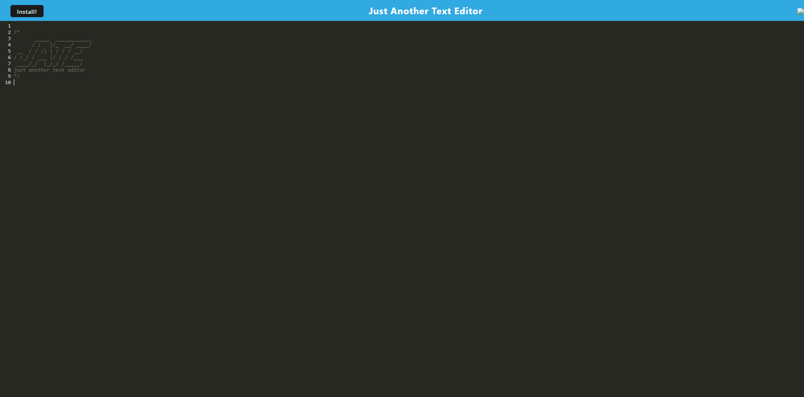

# textEditor
 A text editor that runs in the browser, this app is a single-page application that meets the PWA criteria.

## Technologies used 
Javascript, Node, NPM, express, html, css, ifenv, React, webpack nodemon, concurrently

## Usage
Use JATE to write out code snippets, whether online or offline, or write yourself notes.

## Example of webpage

## Deployed Webpage
Click <a href="https://edtioroftextjate-ef70ffa3c2e5.herokuapp.com/">here</a>